# Architecture Diagram

Arrows are allowed capabilities. Missing arrows are denied by nftables uid
rules, Unix peer credentials, Postgres grants, filesystem ownership, fixed sudo
rules, or route allowlists. The operator plane groups the human-facing access
paths; `cloudflared` is the host user that connects one of those paths to the
admin API. The storage boxes summarize persistence and ownership boundaries.
Storage arrows show durable file ownership/use relationships, not local IPC.

```mermaid
flowchart LR
    subgraph operatorplane["operator plane"]
        direction TB
        operator["Human operator"]
        ssh["trustyclaw-operator<br/>host SSH user<br/>passwordless sudo"]
        cfedge["Cloudflare Access"]
    end

    subgraph outside["outside internet"]
        direction TB
        outside_services["Internet services<br/>GitHub, OpenAI, Anthropic,<br/>package registries, tool APIs"]
    end

    subgraph ec2["AWS EC2 host"]
        direction TB

        subgraph services["users"]
            direction TB
            root["root<br/>owns root filesystem + host code<br/>executes eleven fixed helpers only"]
            admin["trustyclaw-admin<br/>Admin API/UI + orchestrator<br/>127.0.0.1:7443<br/>no internet egress"]
            proxy["trustyclaw-proxy<br/>Network proxy<br/>127.0.0.1:7445<br/>DNS + TCP 80/443 only"]
            tools["trustyclaw-tools<br/>Tool packages + tools.sock<br/>DNS + TCP 443 only"]
            agentnetwork["trustyclaw-agent-network<br/>Network introspection socket<br/>no egress"]
            agentapp["trustyclaw-agent-app<br/>app_api proxy + agent-app.sock<br/>loopback to app ports only"]
            apps["trustyclaw-app-*<br/>App backends<br/>host-slot uid, port, schema<br/>no egress"]
            agent["trustyclaw-agent<br/>Codex + Claude Code<br/>no sudo, DB role, or direct egress"]
            db["postgres<br/>trustyclaw_admin<br/>Unix socket only, peer auth"]
            tunnel["cloudflared<br/>Tunnel connector<br/>DNS, TCP 443/7844, UDP 7844"]
        end

        subgraph storage["storage"]
            direction TB
            rootvol["Root EBS, 16 GiB, replaceable<br/>OS, trusted code, systemd, nftables, helpers<br/>root-owned trust boundary"]
            adminvol["Admin EBS, 16 GiB, durable<br/>Postgres data, admin-home, proxy CA/certs, Git quarantine, temporary tool media<br/>service-owned private subtrees"]
            agentvol["Agent EBS, 8 GiB, durable<br/>agent-home auth, sessions, caches, workspaces<br/>root-owned managed config"]
        end
    end

    operator -->|"SSH, when configured"| ssh
    ssh -->|"sudo is root-equivalent"| root
    ssh -->|"port forward + admin bearer"| admin
    operator -->|"Access identity policy"| cfedge
    tunnel -->|"outbound connector"| cfedge
    cfedge -->|"operator request + admin bearer"| tunnel
    tunnel -->|"forwards to 127.0.0.1:7443"| admin

    admin -->|"eleven exact sudo helpers"| root
    root -->|"demote into transient runtime scopes"| agent
    root -->|"bootstrap, updates, provider/GitHub helpers"| outside_services
    root -->|"OS, host code, systemd, nftables, helpers"| rootvol
    root -->|"managed immutable agent config"| agentvol

    agent -->|"HTTP(S)/WS(S) only via 127.0.0.1:7445"| proxy
    proxy -->|"guarded agent egress + GitHub token injection"| outside_services

    agent -->|"MCP list/call, peer uid route"| tools
    agent -->|"network status + denials, peer uid"| agentnetwork
    admin -->|"operator tool routes, peer uid route"| tools
    tools -->|"third-party tool APIs"| outside_services

    admin -->|"reverse proxy to assigned loopback ports"| apps
    apps -->|"app-backend.sock task/thread allowlist, peer uid"| admin

    agent -->|"app_api via agent-app.sock, cgroup thread attribution"| agentapp
    agentapp -->|"reverse proxy to owning app's /agent/ routes"| apps

    admin -->|"owner role, all host tables"| db
    admin -->|"admin-home + disk version"| adminvol
    proxy -->|"enforcement reads, event/push writes, working token"| db
    proxy -->|"CA keypair, leaf certs, Git quarantine"| adminvol
    tools -->|"tool tables + secret key only"| db
    agentnetwork -->|"SELECT-only policy + events"| db
    tools -->|"bounded temporary media"| adminvol
    apps -->|"own app schema only"| db
    db -->|"PGDATA"| adminvol
    agent -->|"agent-home, sessions, caches, workspaces"| agentvol

```

